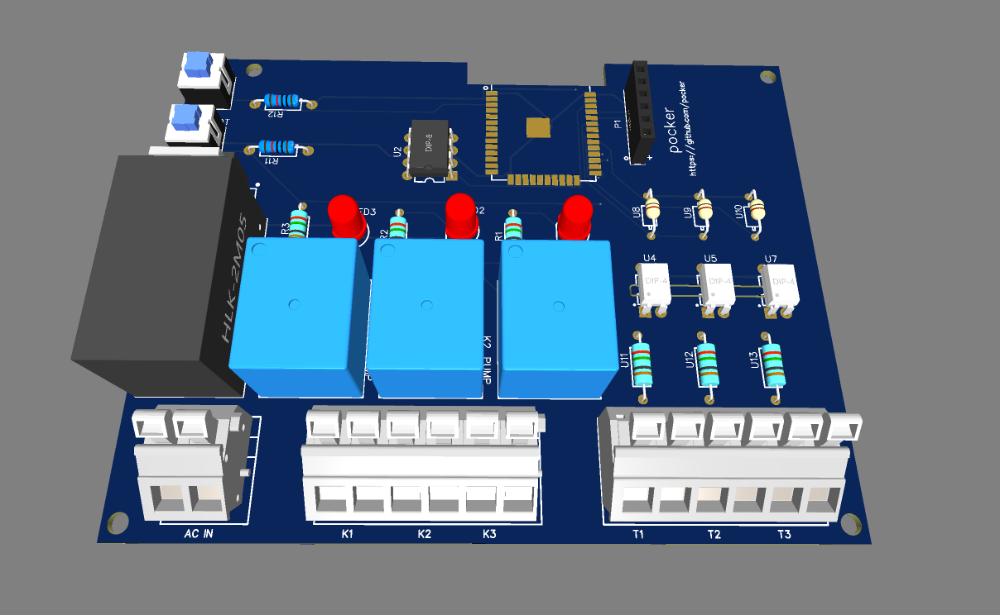
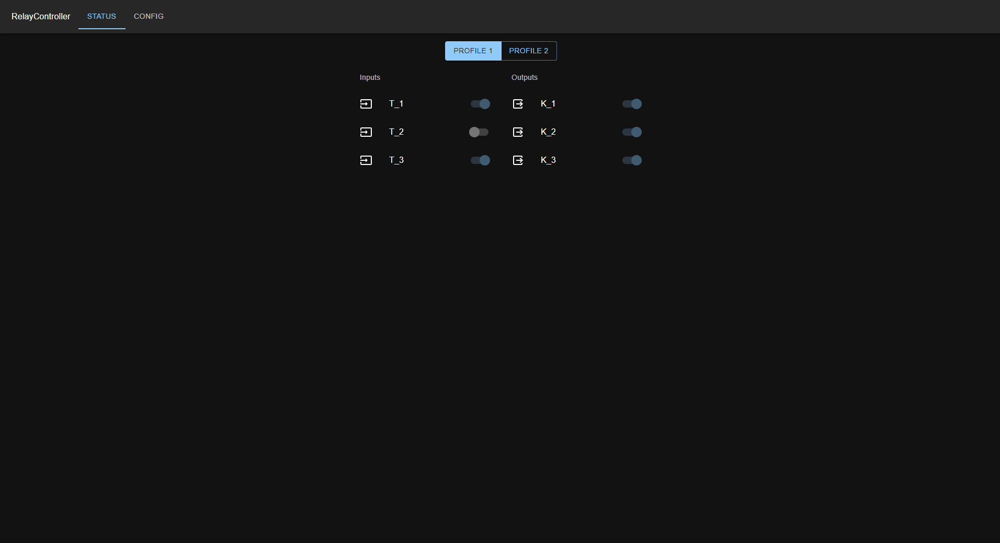
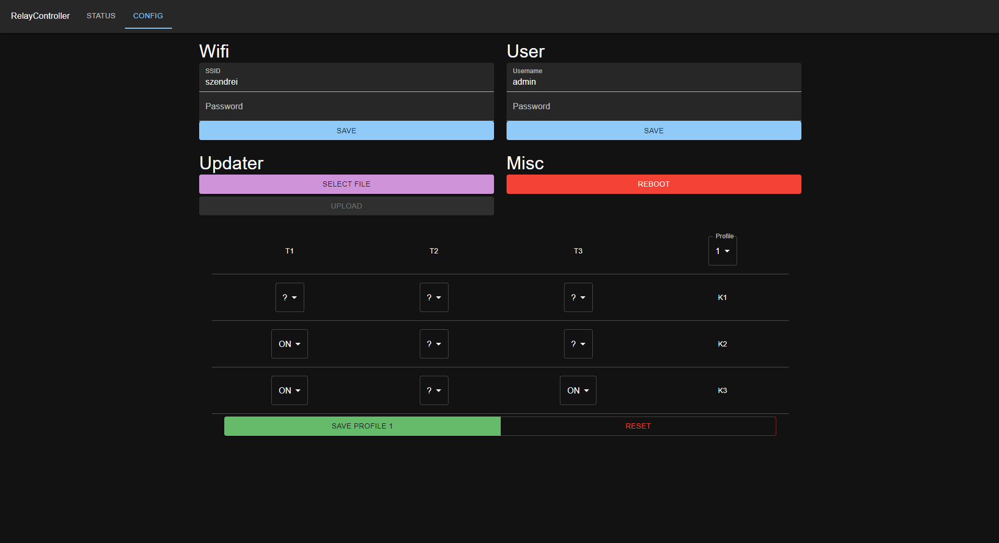

# Board information

> # ⚠️Danger
>⚡Please keep in mind that the board operates with high voltage. Do not touch the components!⚡

## ESP Pinout
| Name | IO     |
|------|--------|
| T_1  | GPIO21 |
| T_2  | GPIO19 |
| T_3  | GPIO18 |
| K_1  | GPIO22 |
| K_2  | GPIO17 |
| K_3  | GPIO16 |
| RX   | GPIO3  |  
| TX   | GPIO1  |
| RST  | EN     |
| BOOT | GPIO0  |

## Connectors
| Name  | Description                                |
|-------|--------------------------------------------|
| AC IN | Power input for the board. (220VAC)        |
| K*    | Outputs for the relays.(default state: NC) |
| T*    | 220V AC/DC signal inputs.                  |

## Default values
Once you connected to the device or the device is in your LAN you can access it via the [http://relay-controller.local](http://relay-controller.local) url.

### Wifi
By default the device will act as an AP. If the AP isn't available (after 1 min from boot) the device will enter into AP mode. 
* SSID: relay-controller
* password: 12345678
> If you change the wifi please reboot the device.
### User
Anonymous user has read access but can't change the config.
* username: admin
* password: admin
> Changeable in the config tab.

## Web UI

## Known bugs
- [ ] the LEDs of the K2 and K3 output is swapped.
